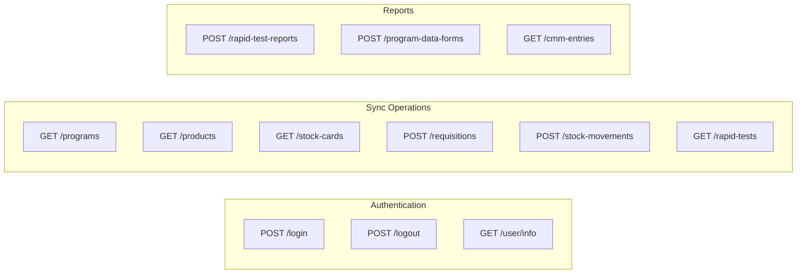
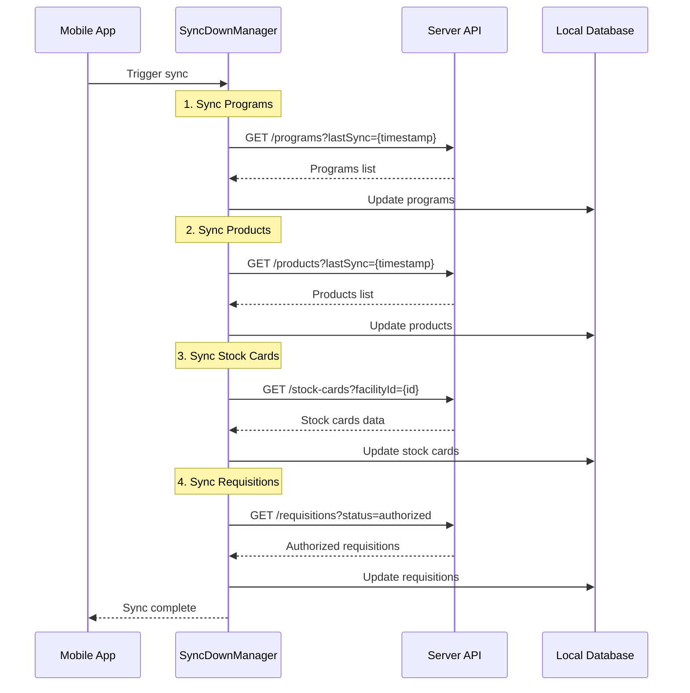
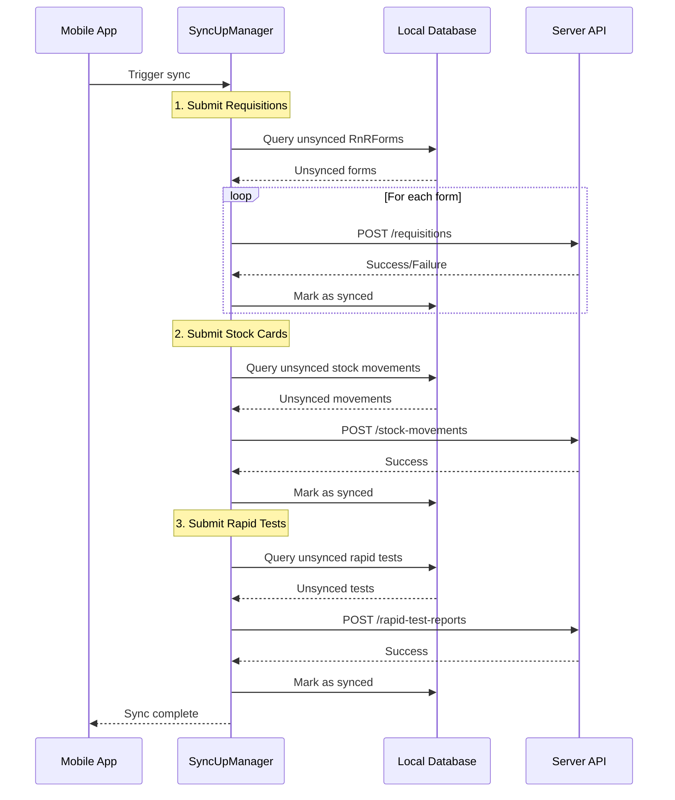
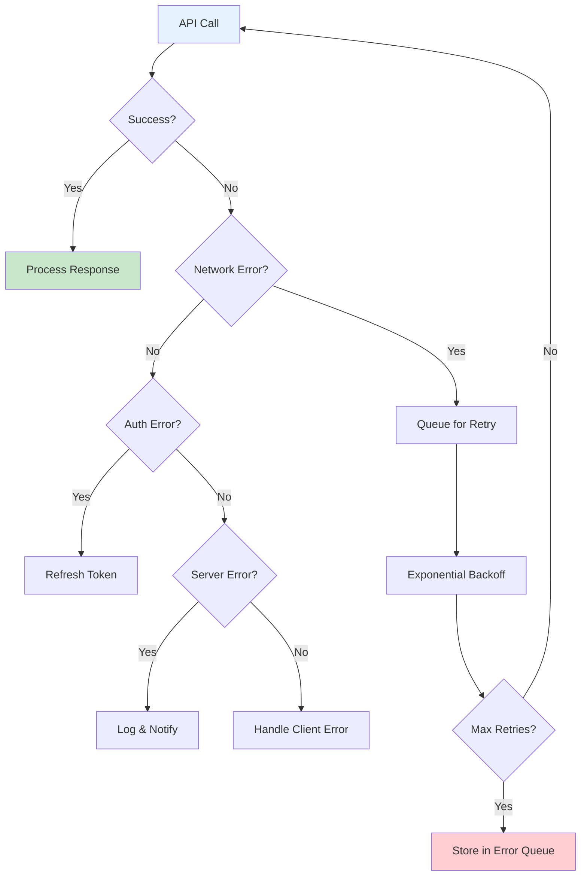
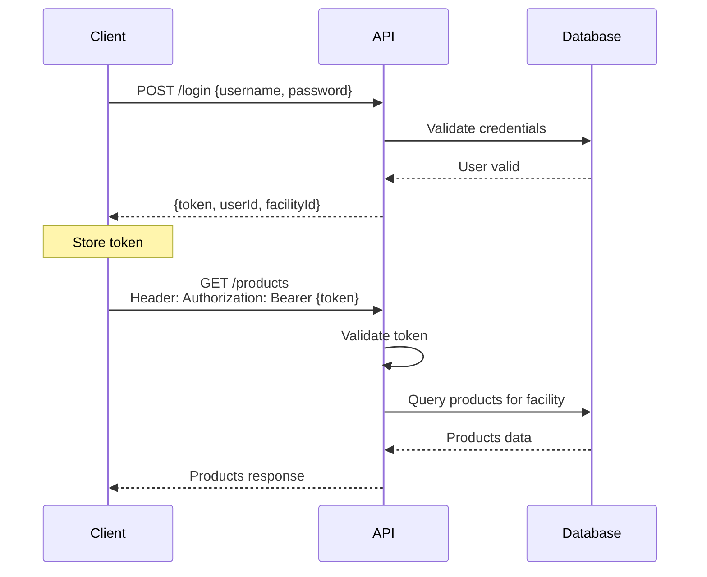
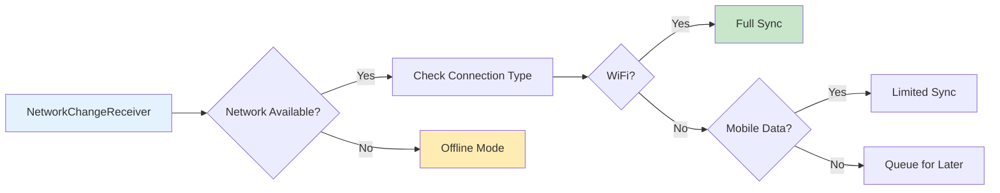

# Guia de Integração e APIs - SIGLAB Mobile

## 1. Visão Geral da Integração

O SIGLAB Mobile comunica com o servidor backend através de APIs REST, implementadas usando Retrofit. O sistema foi desenhado para funcionar offline-first, sincronizando dados quando há conectividade disponível.

## 2. Endpoints da API

### 2.1 Estrutura Base

```java
// Interface principal: LMISRestApi
public interface LMISRestApi {
    // Base URL configurada por ambiente
    // Local: http://localhost:8080
    // Dev: http://dev.siglab.mz
    // QA: http://qa.siglab.mz
    // Prod: http://api.siglab.mz
}
```

### 2.2 Principais Endpoints



### 2.3 Detalhes dos Endpoints

#### Autenticação

| Endpoint | Método | Descrição | Payload |
|----------|--------|-----------|---------|
| `/login` | POST | Autenticar usuário | `{username, password, facilityCode}` |
| `/user/info` | GET | Obter informações do usuário | - |

#### Sincronização de Dados

| Endpoint | Método | Descrição | Parâmetros |
|----------|--------|-----------|------------|
| `/programs` | GET | Baixar programas disponíveis | `lastSync` |
| `/products` | GET | Baixar produtos | `lastSync, programCode` |
| `/stock-cards` | GET | Baixar stock cards | `facilityId, lastSync` |
| `/stock-cards` | POST | Enviar stock cards | Body: `StockCard[]` |
| `/requisitions` | POST | Submeter requisições | Body: `RnRForm` |

## 3. Fluxo de Sincronização Detalhado

### 3.1 Sincronização Descendente (Down Sync)



### 3.2 Sincronização Ascendente (Up Sync)



## 4. Modelos de Dados para API

### 4.1 Modelo de Requisição (RnRForm)

```json
{
  "programCode": "VIA",
  "facilityId": "12345",
  "actualPeriodStartDate": "2024-01-01",
  "actualPeriodEndDate": "2024-01-31",
  "emergency": false,
  "clientSubmittedTime": "2024-02-01T10:00:00Z",
  "clientSubmittedNotes": "Monthly requisition",
  "products": [
    {
      "productCode": "08S42",
      "beginningBalance": 100,
      "quantityReceived": 50,
      "quantityDispensed": 80,
      "totalLossesAndAdjustments": -5,
      "stockOnHand": 65,
      "calculatedOrderQuantity": 150,
      "requestedQuantity": 150
    }
  ],
  "regimens": [
    {
      "code": "1alt1",
      "name": "TDF+3TC+EFV",
      "patientsOnTreatment": 45
    }
  ],
  "patientQuantifications": [
    {
      "category": "newPatients",
      "total": 12
    }
  ]
}
```

### 4.2 Modelo de Stock Card

```json
{
  "productCode": "08S42",
  "stockOnHand": 250,
  "facilityId": "12345",
  "stockMovementItems": [
    {
      "movementDate": "2024-01-15",
      "movementType": "RECEIVE",
      "movementQuantity": 100,
      "reason": "DISTRICT_DDM",
      "documentNumber": "REC-2024-001",
      "stockOnHand": 350,
      "signature": "user_signature",
      "synced": false
    }
  ],
  "lotsOnHand": [
    {
      "lotNumber": "LOT-2024-A",
      "expirationDate": "2025-06-30",
      "quantityOnHand": 150
    }
  ]
}
```

### 4.3 Modelo de Teste Rápido

```json
{
  "programCode": "TEST_KIT",
  "periodBegin": "2024-01-01",
  "periodEnd": "2024-01-31",
  "submittedTime": "2024-02-01T10:00:00Z",
  "programDataFormItems": [
    {
      "columnCode": "CONSUME_HIVDETERMINE",
      "value": 150
    },
    {
      "columnCode": "POSITIVE_HIVDETERMINE",
      "value": 15
    },
    {
      "columnCode": "UNJUSTIFIED_HIVDETERMINE",
      "value": 2
    }
  ]
}
```

## 5. Gestão de Erros e Retry

### 5.1 Estratégia de Retry



### 5.2 Códigos de Erro

| Código | Descrição | Ação |
|--------|-----------|------|
| 200 | Sucesso | Processar resposta |
| 401 | Não autorizado | Re-autenticar |
| 403 | Proibido | Mostrar erro ao usuário |
| 404 | Não encontrado | Log e ignorar |
| 409 | Conflito | Resolver conflito localmente |
| 500 | Erro servidor | Retry com backoff |
| 503 | Serviço indisponível | Retry mais tarde |

## 6. Segurança da API

### 6.1 Autenticação e Autorização



### 6.2 Certificados SSL

O aplicativo suporta diferentes certificados SSL por ambiente:

```
app/src/
├── dev/res/raw/
│   └── cert.crt      # Certificado desenvolvimento
├── qa/res/raw/
│   └── cert.crt      # Certificado QA
├── uat/res/raw/
│   └── cert.crt      # Certificado UAT
└── prd/res/raw/
    └── cert.crt      # Certificado produção
```

## 7. Monitoramento de Performance

### 7.1 Métricas Rastreadas

- **Tempo de resposta** das APIs
- **Taxa de sucesso** de sincronização
- **Volume de dados** transferidos
- **Frequência de retry**
- **Erros por endpoint**

### 7.2 Otimizações Implementadas

1. **Compressão GZIP**: Todos os requests/responses são comprimidos
2. **Paginação**: Grandes conjuntos de dados são paginados
3. **Delta Sync**: Apenas mudanças são sincronizadas
4. **Batch Operations**: Múltiplas operações são agrupadas
5. **Cache HTTP**: Respostas são cacheadas quando apropriado

## 8. Configuração de Rede

### 8.1 Timeout Configuration

```java
// Configurações de timeout padrão
public class NetworkConfig {
    public static final int CONNECTION_TIMEOUT = 30; // segundos
    public static final int READ_TIMEOUT = 60; // segundos
    public static final int WRITE_TIMEOUT = 60; // segundos
    public static final int MAX_RETRIES = 3;
    public static final int RETRY_DELAY_BASE = 2; // segundos
}
```

### 8.2 Detecção de Conectividade



## 9. Troubleshooting

### 9.1 Problemas Comuns

| Problema | Causa Provável | Solução |
|----------|---------------|---------|
| Sync não inicia | Sem conexão | Verificar conectividade |
| Dados não aparecem | Sync incompleto | Forçar re-sync |
| Login falha | Credenciais inválidas | Verificar usuário/senha |
| Timeout frequente | Conexão lenta | Aumentar timeout |
| Conflitos de dados | Edições simultâneas | Resolver manualmente |

### 9.2 Logs de Debug

Para debug, o sistema usa Stetho para interceptar chamadas de rede:

```java
// Ativar em builds de desenvolvimento
if (BuildConfig.DEBUG) {
    Stetho.initializeWithDefaults(context);
    okHttpClient.addNetworkInterceptor(new StethoInterceptor());
}
```

## 10. Versionamento da API

O sistema suporta versionamento de API através de:

1. **Headers de versão**: `API-Version: 1.0`
2. **URL versioning**: `/api/v1/`, `/api/v2/`
3. **Backward compatibility**: Novos campos são opcionais

## Conclusão

A integração API do SIGLAB Mobile é robusta, com suporte offline-first, sincronização bidirecional, tratamento de erros, e otimizações de performance. O sistema está preparado para funcionar em ambientes com conectividade limitada, característica essencial para o contexto de saúde em Moçambique.
