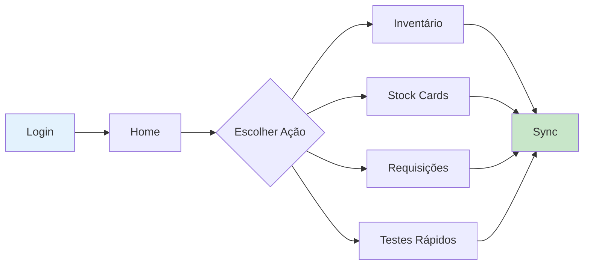

# Guia de Início Rápido - SIGLAB Mobile

## 📱 Sobre o SIGLAB Mobile

Sistema móvel Android para gestão logística de laboratórios em Moçambique, baseado no OpenLMIS.

## 🚀 Setup Rápido

### Pré-requisitos
- Android Studio (última versão)
- JDK 8
- Android SDK 27
- Git

### Clonar e Configurar

```bash
# Clonar repositório
git clone [repository-url]
cd siglab-mobile

# Build inicial
./gradlew build
```

### Executar Aplicação

```bash
# Debug build
./gradlew assembleLocalDebug

# Instalar no dispositivo/emulador
adb install app/build/outputs/apk/local/debug/app-local-debug.apk
```

## 🧪 Executar Testes

```bash
# Testes unitários
./gradlew testLocalDebug

# Testes funcionais
./gradlew functionalTests

# Análise de código
./gradlew checkstyle findbugs
```

## 🏗️ Arquitetura Principal

```
MVP Pattern + RoboGuice DI + RxJava + OrmLite
```

### Componentes-Chave:
- **Activities/Views**: Interface do usuário
- **Presenters**: Lógica de negócio
- **Repositories**: Acesso a dados
- **Services**: Sincronização e background tasks

## 📋 Programas Suportados

### Programas Gerais
- **VIA**: Via Clássica (Requisições gerais)
- **MMIA**: MMIA (ARV e relacionados)
- **AL**: Malária
- **PTV**: Prevenção Transmissão Vertical
- **TEST_KIT**: Testes Rápidos

### Equipamentos Laboratoriais
- Abbott M2000 / Alinity M
- Roche Cobas 6800 / 5800 / CAPCTM 96
- Hologic Panter
- POC mPIMA
- Material de Biossegurança

## 🔄 Fluxo de Trabalho Principal



## 🌐 Ambientes

| Ambiente | Package | Uso |
|----------|---------|-----|
| **local** | .core.local | Desenvolvimento |
| **dev** | .core.dev | Dev Server |
| **qa** | .core.qa | Testes QA |
| **uat** | .core.uat | UAT |
| **prd** | .core | Produção |

## 📁 Estrutura de Pastas

```
app/src/main/java/org/openlmis/core/
├── model/          # Entidades
├── view/           # UI (Activities, Adapters)
├── presenter/      # Lógica MVP
├── service/        # Serviços
├── persistence/    # Database
├── network/        # APIs
└── utils/          # Utilitários
```

## 🔑 Funcionalidades Principais

1. **Gestão de Stock**
   - Movimentações (Entrada/Saída)
   - Inventário físico
   - Ajustes e perdas

2. **Requisições**
   - Criar e submeter requisições
   - Múltiplos programas
   - Aprovação e autorização

3. **Testes Rápidos**
   - HIV, Sífilis, Malária
   - Relatórios mensais
   - Validações automáticas

4. **Sincronização**
   - Offline-first
   - Sync automático e manual
   - Resolução de conflitos

## ⚙️ Configurações Importantes

### Feature Toggles
```xml
<!-- app/src/main/res/values/feature_toggle_config.xml -->
<bool name="feature_rapid_test">true</bool>
<bool name="feature_archive_old_data">true</bool>
```

### Sync Interval
```xml
<!-- app/src/main/res/values/config.xml -->
<integer name="sync_interval">3600</integer> <!-- 1 hora -->
```

## 🐛 Debug e Troubleshooting

### Ferramentas de Debug
- **Stetho**: Inspect database e network calls
- **Crashlytics**: Crash reports (produção)
- **Google Analytics**: Tracking de uso

### Logs Úteis
```bash
# Ver logs do aplicativo
adb logcat | grep -i "openlmis"

# Database path
/data/data/org.openlmis.core.[env]/databases/lmis_db
```

## 📝 Comandos Úteis

```bash
# Build específico
./gradlew assembleQaDebug
./gradlew assemblePrdRelease

# Limpar projeto
./gradlew clean

# Gerar APK signed
./gradlew assembleRelease

# Executar testes específicos
./gradlew testLocalDebugUnitTest --tests "*LoginPresenterTest"

# Coverage report
./gradlew jacocoTestReport
```

## 🤝 Contribuindo

1. Crie branch da feature: `git checkout -b feature/nova-funcionalidade`
2. Escreva testes primeiro (TDD)
3. Implemente a funcionalidade
4. Execute testes: `./gradlew test`
5. Análise estática: `./gradlew checkstyle`
6. Commit: `git commit -m "feat: descrição"`
7. Push: `git push origin feature/nova-funcionalidade`
8. Crie Pull Request

## 📚 Documentação Adicional

- [Documentação Técnica Completa](SIGLAB_Mobile_Documentation.md)
- [Guia de Integração API](API_Integration_Guide.md)
- [Guia de Testes](../app/src/test/guide.md)

## ⚠️ Avisos Importantes

1. **Nunca** fazer commit de credenciais ou tokens
2. **Sempre** testar sincronização após mudanças
3. **Validar** em todos os ambientes antes de produção
4. **Manter** backwards compatibility com servidor

## 📞 Suporte

Para questões técnicas, consultar:
- Documentação interna
- Equipe de desenvolvimento
- Issues no repositório

---

**Última atualização**: Dezembro 2024
**Versão do documento**: 1.0
