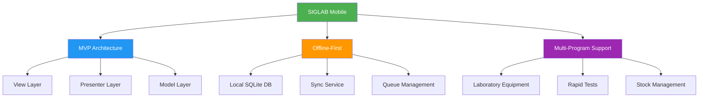

# 📚 Documentação SIGLAB Mobile

## Bem-vindo à Documentação do SIGLAB Mobile

Esta pasta contém toda a documentação técnica do Sistema de Informação de Gestão Logística de Laboratório - Componente Mobile.

## 📖 Documentos Disponíveis

### 1. [**Guia de Início Rápido**](Quick_Start_Guide.md)
Guia essencial para novos desenvolvedores começarem rapidamente com o projeto.
- Setup inicial
- Comandos básicos
- Estrutura do projeto
- Fluxos principais

### 2. [**Documentação Técnica Completa**](SIGLAB_Mobile_Documentation.md)
Documentação detalhada de toda a arquitetura e componentes do sistema.
- Arquitetura completa do sistema
- Modelos de dados e fluxos
- Diagramas técnicos com Mermaid
- Funcionalidades por módulo
- Sistema de testes
- Processo de build e deploy

### 3. [**Guia de Integração e APIs**](API_Integration_Guide.md)
Documentação específica sobre integração com o servidor backend.
- Endpoints disponíveis
- Modelos de dados da API
- Fluxos de sincronização
- Gestão de erros
- Segurança e autenticação

## 🏗️ Arquitetura Resumida

## 🔧 Stack Tecnológico

- **Plataforma**: Android (SDK 27, Min SDK 17)
- **Linguagem**: Java 8
- **Arquitetura**: MVP (Model-View-Presenter)
- **DI**: RoboGuice 3.0.1
- **Database**: SQLite + OrmLite
- **Networking**: Retrofit 1.9.0
- **Reactive**: RxJava/RxAndroid
- **Testes**: JUnit, Robolectric, Calabash

## 📋 Programas Laboratoriais Suportados

### Programas Gerais
- VIA (Via Clássica)
- MMIA 
- AL (Malária)
- PTV (Prevenção Transmissão Vertical)
- Testes Rápidos

### Equipamentos Específicos
- Abbott (M2000, Alinity M)
- Roche (Cobas 6800/5800, CAPCTM 96)
- Hologic Panter
- POC mPIMA
- Material de Biossegurança

## 🚀 Como Usar Esta Documentação

1. **Novos Desenvolvedores**: Comece pelo [Guia de Início Rápido](Quick_Start_Guide.md)
2. **Desenvolvimento de Features**: Consulte a [Documentação Técnica](SIGLAB_Mobile_Documentation.md)
3. **Integração Backend**: Veja o [Guia de APIs](API_Integration_Guide.md)
4. **Testes**: Consulte o [Guia de Testes](../app/src/test/guide.md)

## 🔄 Manutenção da Documentação

Esta documentação deve ser atualizada sempre que:
- Novas funcionalidades forem adicionadas
- APIs forem modificadas
- Arquitetura sofrer mudanças
- Novos programas laboratoriais forem integrados

## 📝 Convenções

- Diagramas técnicos usam Mermaid
- Exemplos de código em Java
- Comandos bash para terminal
- Markdown para formatação

## 📞 Contacto e Suporte

Para questões sobre a documentação ou o sistema:
- Consulte os documentos disponíveis
- Verifique os issues do repositório
- Contacte a equipe de desenvolvimento

## 🗓️ Histórico de Versões

| Versão | Data | Descrição |
|--------|------|-----------|
| 1.0 | Dez 2024 | Documentação inicial completa |

---

**Sistema de Informação de Gestão Logística de Laboratório**  
*Componente Mobile para Android*  
*Moçambique*
