# Documentação Técnica - SIGLAB Mobile

## 1. Visão Geral do Sistema

### 1.1 Introdução
O **SIGLAB Mobile** (Sistema de Informação de Gestão Logística de Laboratório) é a componente móvel do sistema SIGLAB, desenvolvido para dispositivos Android. É uma adaptação do OpenLMIS (Open Logistics Management Information System) especificamente configurado para gestão logística de laboratórios em Moçambique.

### 1.2 Objetivo
O aplicativo móvel permite aos laboratórios de saúde gerir:
- Inventário e stock de materiais laboratoriais
- Requisições e formulários específicos para diferentes equipamentos laboratoriais
- Testes rápidos e programas de saúde
- Sincronização de dados com servidor central
- Relatórios e análises de consumo

### 1.3 Arquitetura de Alto Nível

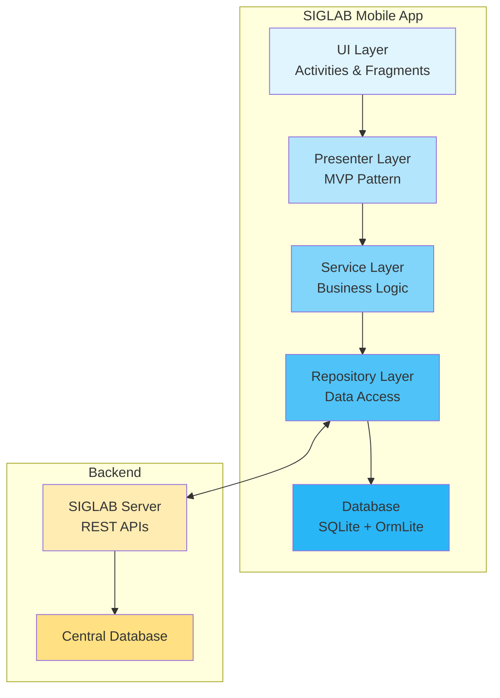

## 2. Tecnologias e Frameworks

### 2.1 Stack Tecnológico Principal

| Componente | Tecnologia | Versão | Propósito |
|------------|------------|---------|-----------|
| **Linguagem** | Java | 8 | Desenvolvimento principal |
| **Plataforma** | Android | SDK 27, Min SDK 17 | Sistema operacional móvel |
| **Build Tool** | Gradle | - | Compilação e gestão de dependências |
| **DI Framework** | RoboGuice | 3.0.1 | Injeção de dependências |
| **ORM** | OrmLite | 4.45 | Mapeamento objeto-relacional |
| **Networking** | Retrofit | 1.9.0 | Comunicação REST API |
| **Reactive** | RxJava/RxAndroid | 1.0.14/1.0.1 | Programação reativa |
| **Testing** | JUnit, Robolectric, Mockito | - | Testes unitários |
| **Testing UI** | Calabash | 0.9.0 | Testes funcionais |
| **Analytics** | Google Analytics, Crashlytics | - | Monitoramento e crash reports |

### 2.2 Padrão Arquitetural - MVP (Model-View-Presenter)

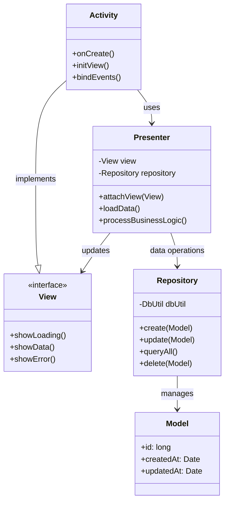

## 3. Estrutura do Projeto

### 3.1 Organização de Diretórios

```
siglab-mobile/
├── app/
│   ├── src/
│   │   ├── main/
│   │   │   ├── java/org/openlmis/core/
│   │   │   │   ├── model/           # Modelos de dados
│   │   │   │   ├── view/            # Activities e Adapters
│   │   │   │   ├── presenter/       # Presenters (MVP)
│   │   │   │   ├── service/         # Serviços e sincronização
│   │   │   │   ├── persistence/     # Camada de persistência
│   │   │   │   ├── network/         # Comunicação de rede
│   │   │   │   ├── manager/         # Gerenciadores
│   │   │   │   └── utils/           # Utilitários
│   │   │   ├── res/                 # Recursos (layouts, strings, etc)
│   │   │   └── AndroidManifest.xml
│   │   ├── test/                    # Testes unitários
│   │   └── [dev|qa|uat|prd|training|showcase]/ # Ambientes
│   └── build.gradle
├── functionalTests/                  # Testes funcionais Calabash
├── contractTests/                    # Testes de contrato
└── docker/                          # Configurações Docker
```

## 4. Principais Funcionalidades

### 4.1 Programas de Laboratório Suportados

O sistema suporta múltiplos programas específicos para diferentes equipamentos e protocolos laboratoriais:

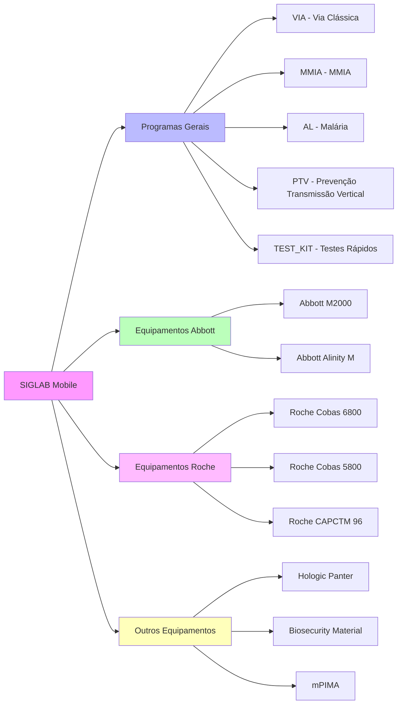

### 4.2 Fluxo de Dados Principal

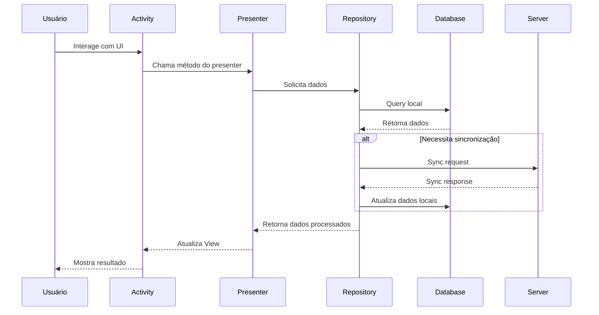

## 5. Modelos de Dados Principais

### 5.1 Hierarquia de Modelos

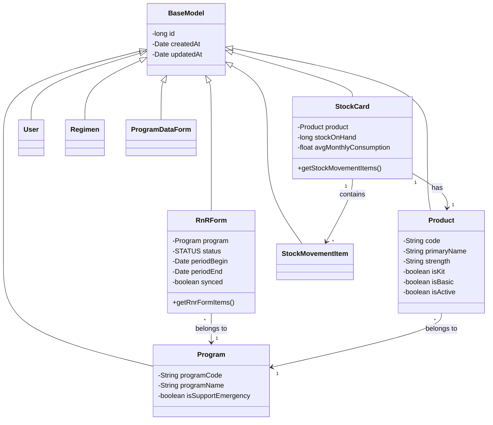

### 5.2 Estados de Requisição (RnR Form)

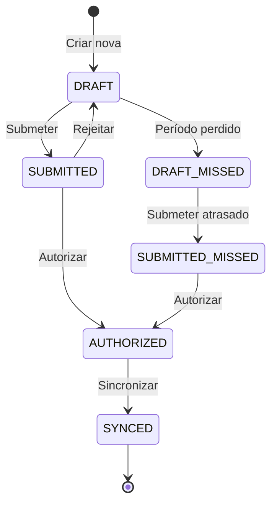

## 6. Sistema de Sincronização

### 6.1 Arquitetura de Sincronização

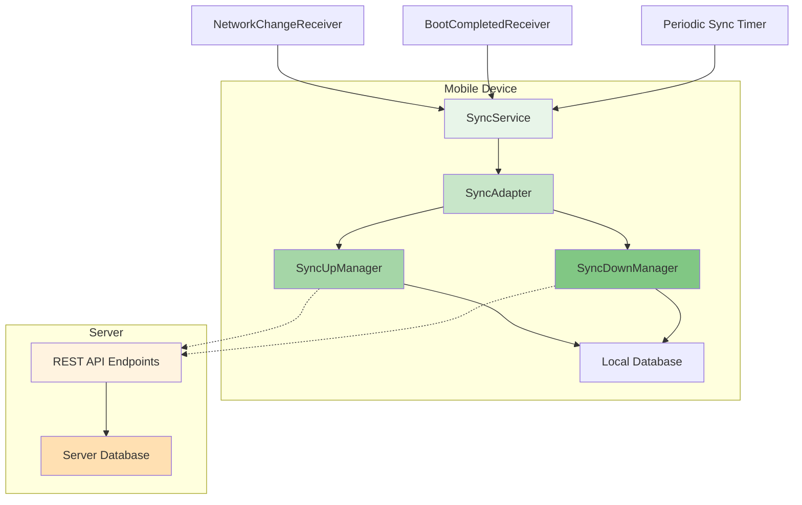

### 6.2 Fluxo de Sincronização

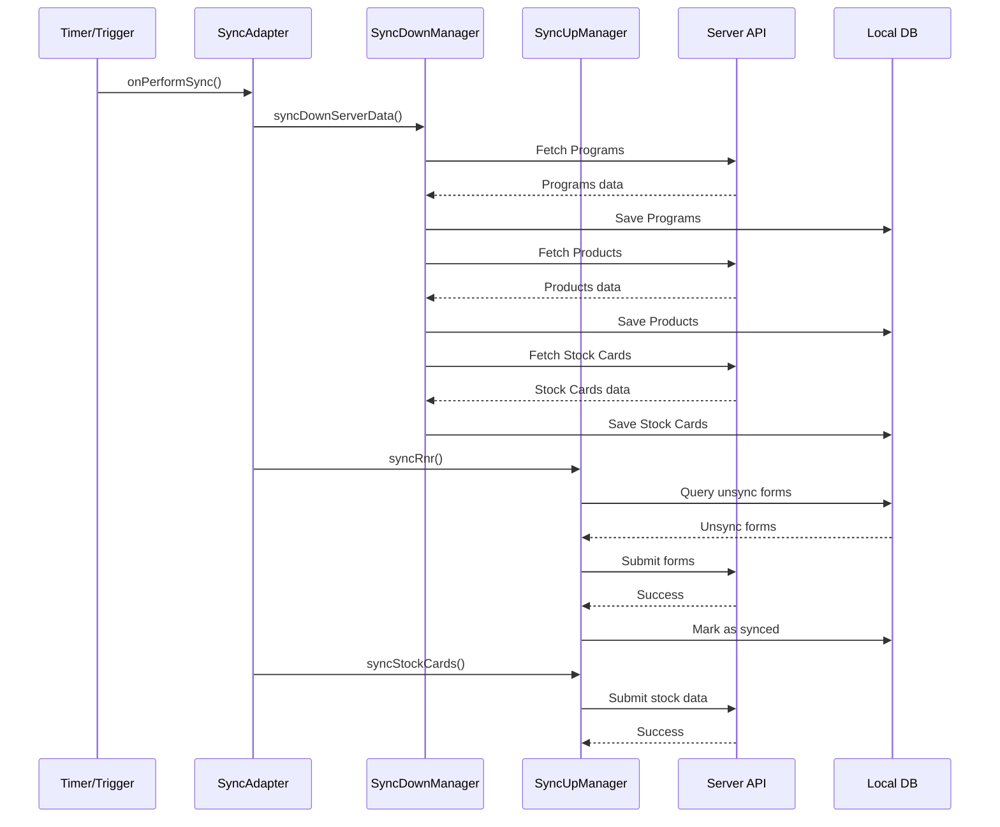

## 7. Gestão de Stock

### 7.1 Movimentações de Stock

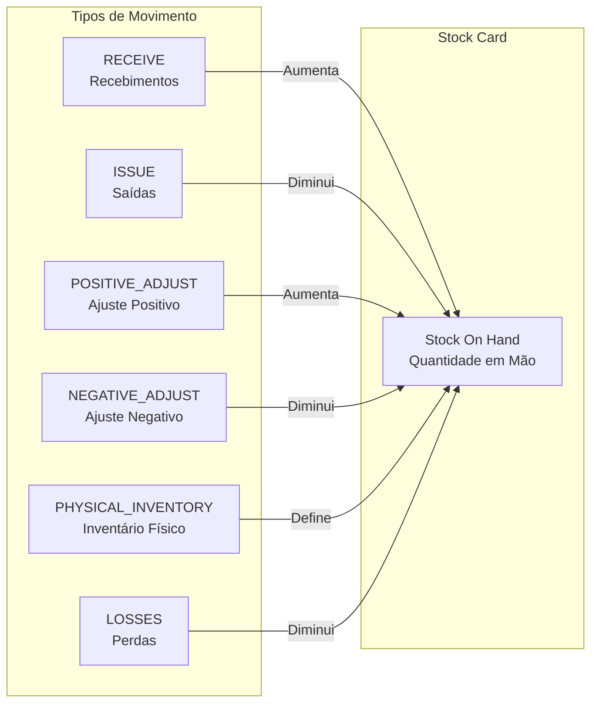

### 7.2 Razões de Movimento Específicas

**Recebimentos (RECEIVE):**
- QUIMOFAR - Fornecedor Quimofar
- HOSPITEC - Fornecedor Hospitec
- THL - Fornecedor THL
- DISTRICT_DDM - Distrito (DDM)
- OTHERS - Outros

**Saídas (ISSUE):**
- UNPACK_KIT - Desempacotar kit
- Equipamentos específicos (Abbott, Roche, etc.)

**Ajustes e Perdas:**
- Produtos expirados
- Produtos danificados
- Correções de inventário
- Empréstimos
- Devoluções

## 8. Testes Rápidos (Rapid Tests)

### 8.1 Estrutura de Dados

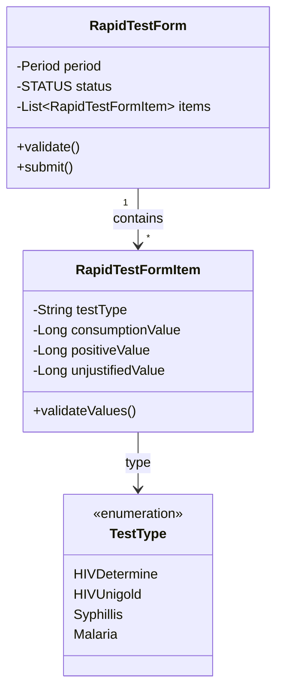

## 9. Sistema de Testes

### 9.1 Estrutura de Testes

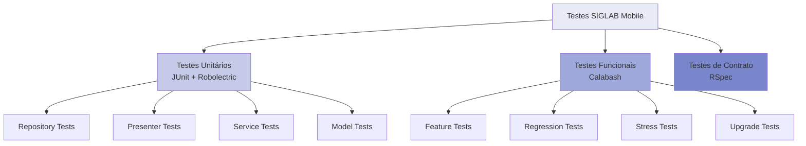

### 9.2 Cobertura de Testes

- **Testes Unitários**: Cobrem lógica de negócio, repositórios, presenters e serviços
- **Testes Funcionais**: Validam fluxos completos de usuário usando Calabash
- **Testes de Regressão**: Garantem que funcionalidades existentes não quebrem
- **Testes de Stress**: Validam performance com grandes volumes de dados

## 10. Persistência de Dados

### 10.1 Migrações de Database

O sistema usa um sistema de migrações incrementais para evoluir o schema do banco de dados:

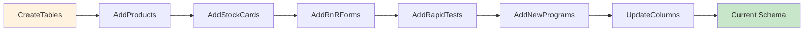

### 10.2 Repositórios Principais

| Repositório | Responsabilidade |
|-------------|------------------|
| **ProductRepository** | Gestão de produtos |
| **StockRepository** | Controle de stock cards |
| **RnrFormRepository** | Formulários de requisição |
| **UserRepository** | Dados de usuários |
| **ProgramRepository** | Programas disponíveis |
| **InventoryRepository** | Inventários físicos |
| **ProgramDataFormRepository** | Formulários de dados de programa |

## 11. Segurança e Autenticação

### 11.1 Fluxo de Autenticação

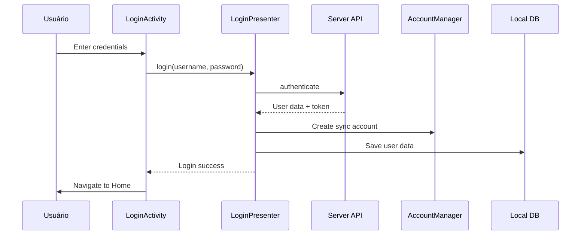

## 12. Funcionalidades por Ambiente

### 12.1 Ambientes Disponíveis

| Ambiente | Package ID | Uso |
|----------|------------|-----|
| **Local** | org.openlmis.core.local | Desenvolvimento local |
| **Dev** | org.openlmis.core.dev | Desenvolvimento |
| **QA** | org.openlmis.core.qa | Testes QA |
| **UAT** | org.openlmis.core.uat | Testes de aceitação |
| **Training** | org.openlmis.core.training | Treinamento |
| **Production** | org.openlmis.core | Produção |
| **Showcase** | org.openlmis.core.showcase | Demonstração |

### 12.2 Feature Toggles

```xml
<bool name="feature_archive_old_data">true</bool>
<bool name="feature_training">false</bool>
<bool name="feature_rapid_test">true</bool>
<bool name="feature_all_drugs_movements_history">true</bool>
<bool name="feature_basic_products_in_inventory">true</bool>
<bool name="feature_patient_data">false</bool>
```

## 13. Integração com Equipamentos Laboratoriais

### 13.1 Equipamentos Suportados

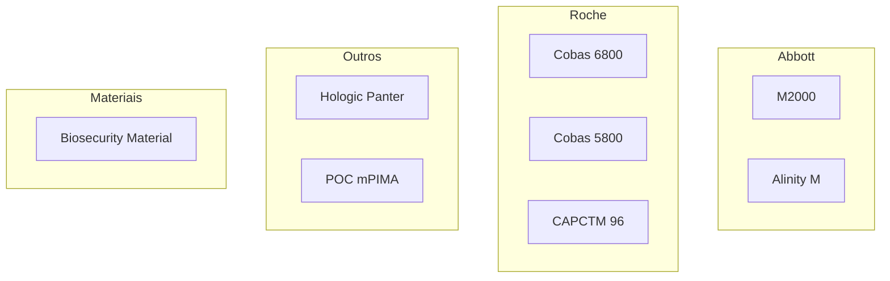

Cada equipamento tem seu próprio programa e formulário de requisição específico, adaptado às necessidades e consumíveis particulares de cada máquina.

## 14. Monitoramento e Analytics

### 14.1 Google Analytics

O sistema rastreia:
- Navegação entre telas
- Ações importantes (submissão de formulários, sincronização)
- Erros e exceções
- Tempo de uso

### 14.2 Crashlytics

- Monitoramento de crashes em produção
- Stack traces detalhados
- Métricas de estabilidade
- Alertas automáticos

## 15. Considerações de Performance

### 15.1 Otimizações Implementadas

1. **Cache de Dados**: Dados frequentemente acessados são mantidos em cache
2. **Lazy Loading**: Carregamento sob demanda de listas grandes
3. **Batch Operations**: Operações em lote para reduzir transações de DB
4. **Sincronização Incremental**: Apenas dados alterados são sincronizados
5. **Compressão**: Dados são comprimidos antes do envio ao servidor

### 15.2 Gestão de Memória

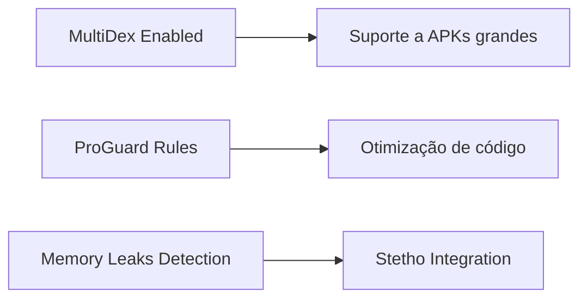

## 16. Processo de Build e Deploy

### 16.1 Pipeline de Build

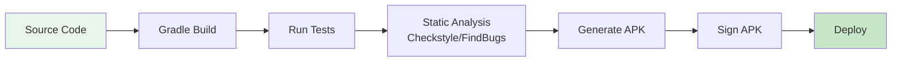

### 16.2 Comandos Principais

```bash
# Testes unitários
./gradlew testLocalDebug

# Testes funcionais
./gradlew functionalTests

# Build de produção
./gradlew assemblePrdRelease

# Análise estática
./gradlew checkstyle findbugs
```

## 17. Conclusão

O SIGLAB Mobile é um sistema robusto e completo para gestão logística laboratorial, com arquitetura bem definida, testes abrangentes e suporte para múltiplos programas e equipamentos laboratoriais. A aplicação segue boas práticas de desenvolvimento Android, incluindo:

- Padrão MVP para separação de responsabilidades
- Injeção de dependências com RoboGuice
- Programação reativa com RxJava
- Testes automatizados em múltiplos níveis
- Sincronização robusta offline-first
- Suporte para múltiplos ambientes e configurações

O sistema está preparado para escalar e adicionar novos programas e funcionalidades conforme necessário para atender às necessidades do sistema de saúde de Moçambique.
